## Module: ir

```mermaid
classDiagram
    class Language {
        <<enum>>
        Rust
        Java
        JavaScript
        Kotlin
        +as_str() &
    }
    class TypeKind {
        <<enum>>
        Struct
        Enum
        Trait
        Class
        Interface
        Object
        Record
        DataClass
        SealedClass
        +as_str() &
    }
    class Visibility {
        <<enum>>
        Public
        Private
        Protected
        Internal
        Crate
        +as_str() &
        +mermaid_marker() &
    }
    class RelationKind {
        <<enum>>
        Extends
        Implements
        ImplTrait
    }
    class CallRef {
        +Option~String~ target_type
        +String target_method
        -fmt(&mut std::fmt::Formatter f) std::fmt
    }
    class TypeRelation {
        +RelationKind kind
        +String target
    }
    class Annotation {
        +String name
    }
    class Param {
        +String name
        +String type_name
        -fmt(&mut std::fmt::Formatter f) std::fmt
    }
    class Field {
        +String name
        +String type_name
        +Visibility visibility
    }
    class Method {
        +String name
        +Vec~Param~ params
        +Option~String~ return_type
        +Visibility visibility
        +Vec~CallRef~ calls
        +Vec~Annotation~ annotations
        +bool is_static
    }
    class Function {
        +String name
        +Vec~Param~ params
        +Option~String~ return_type
        +Visibility visibility
        +Vec~CallRef~ calls
    }
    class TypeDef {
        +String name
        +TypeKind kind
        +Visibility visibility
        +Vec~Field~ fields
        +Vec~Method~ methods
        +Vec~TypeRelation~ relations
        +Vec~Annotation~ annotations
        +Vec~String~ type_params
        +Vec~String~ enum_variants
    }
    class Module {
        +String path
        +Language language
        +Vec~TypeDef~ types
        +Vec~Function~ functions
    }
    class Project {
        +Vec~Module~ modules
    }
    CallRef ..|> std_fmt_Display : implements
    Param ..|> std_fmt_Display : implements
```

## Module: crate

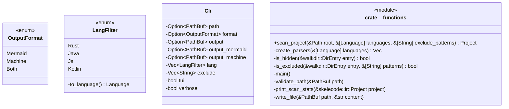

## Module: parser

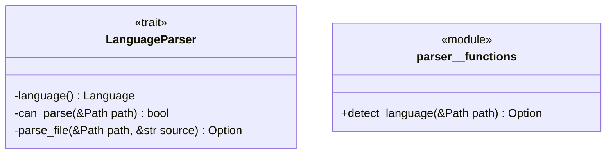

## Module: parser::rust

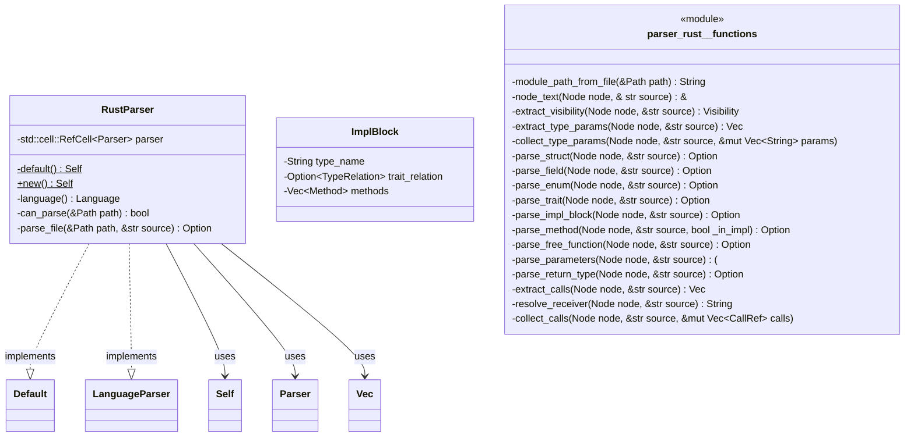

## Module: renderer::machine

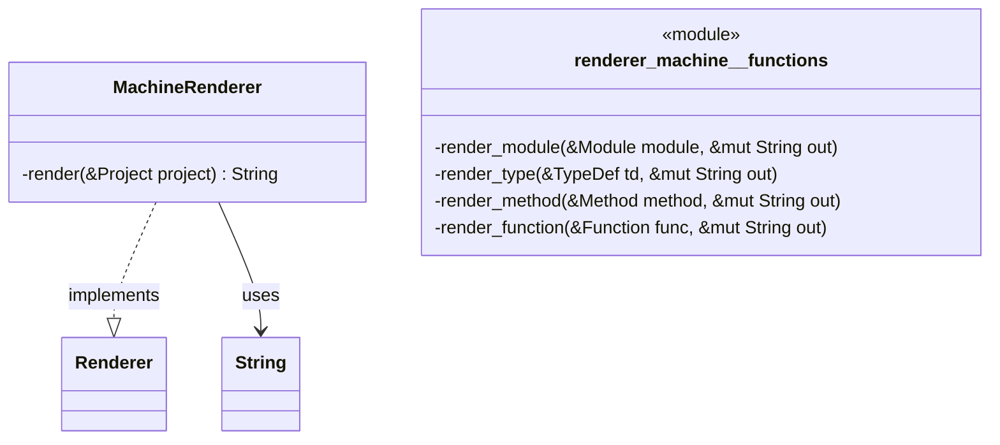

## Module: renderer::mermaid

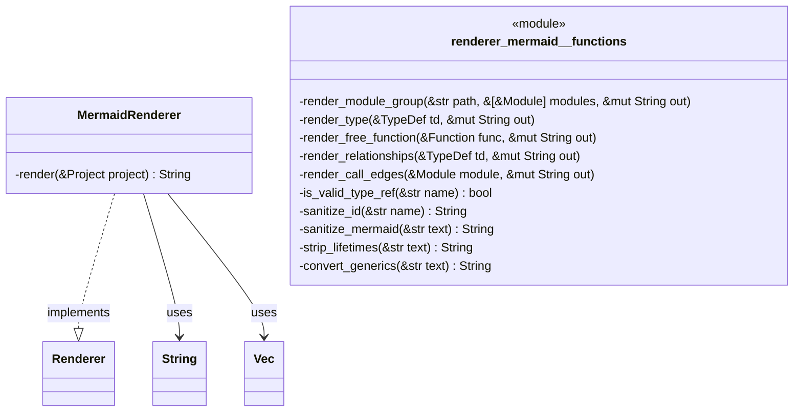

## Module: renderer

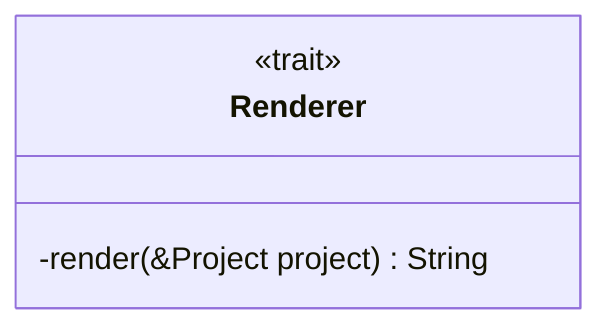

## Module: tui::app

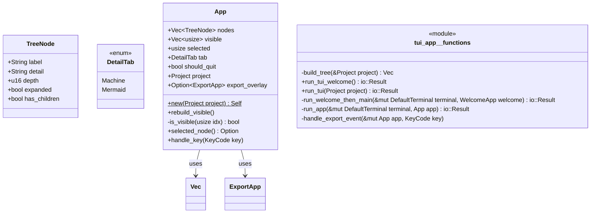

## Module: tui::export

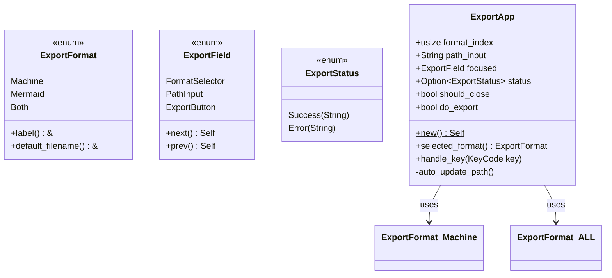

## Module: tui::ui

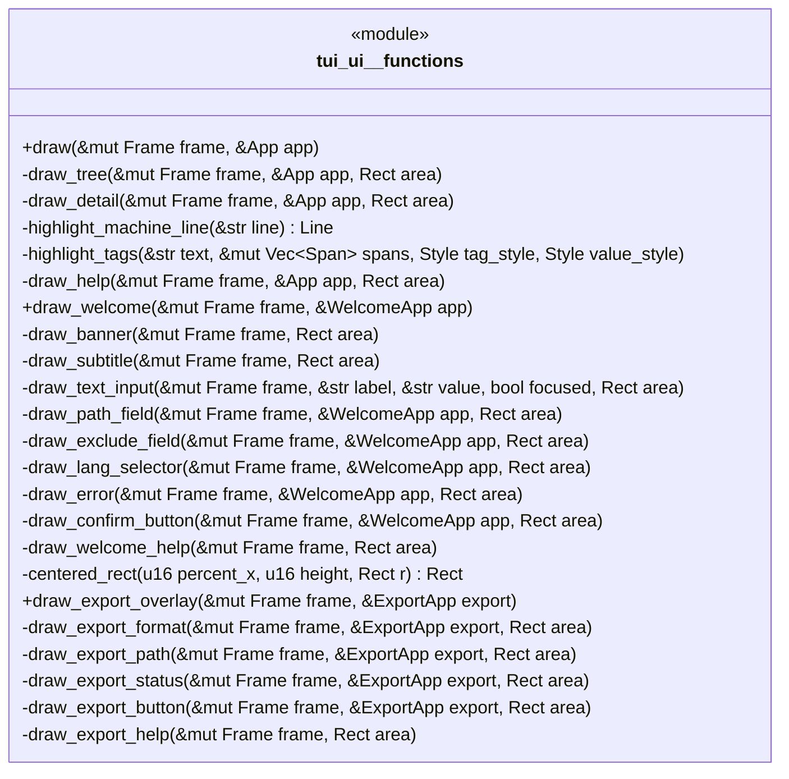

## Module: tui::welcome

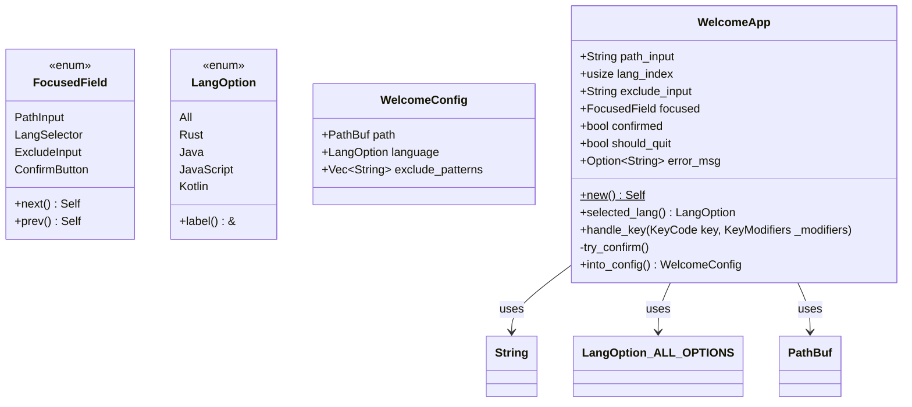
