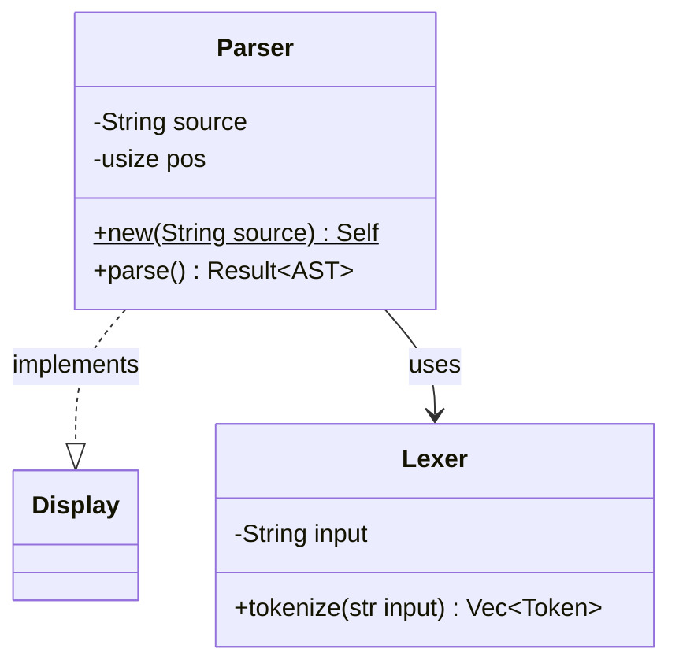

# Skelecode

**Code structure scanner that generates project-wide context graphs for humans and AI.**

## Problem

When AI assistants work with codebases, they face a dilemma:
- **Scan everything** → expensive token consumption, slow
- **Scan partially** → missing context, duplicate code, unused common functions

Skelecode solves this by scanning the project once and producing a **compact structural graph** that captures classes, fields, methods, call relationships, and type hierarchies — without including implementation details.

## How It Works

```
Source Code  ──►  Parser (per language)  ──►  Unified IR  ──►  Output
  .java                                                         ├── TUI (interactive)
  .js/.ts          tree-sitter based          language-          ├── Mermaid (human)
  .kt                                         agnostic          └── Machine Context (AI)
  .rs                                         model
```

1. **Parse** — language-specific parsers extract structural information from source files
2. **Model** — parsed data is normalized into a unified intermediate representation (IR)
3. **Render** — the IR is presented via interactive TUI, or rendered to Mermaid / Machine Context formats

## Output Modes

| Mode | Audience | Description |
|---|---|---|
| **TUI** | Developers | Interactive terminal UI — browse modules, types, methods with keyboard navigation |
| **Mermaid** | Humans | Visual class/call diagrams, renderable in GitHub, VSCode, docs |
| **Machine Context** | AI | Ultra-compact token-optimized format for LLM consumption |

Estimated token savings with Machine Context: **~90-95% reduction** compared to reading raw source code, while preserving structural and relational information.

## Supported Languages

| Language | Extensions | Key Constructs | Status |
|---|---|---|---|
| Rust | `.rs` | struct, enum, trait, impl, mod | Implemented |
| Java | `.java` | class, interface, enum, record, annotations | Implemented |
| JavaScript | `.js`, `.ts`, `.jsx`, `.tsx` | class, function, arrow function, export | Planned |
| Kotlin | `.kt`, `.kts` | class, interface, object, data class, annotations | Planned |

## Installation

### Build from source

```bash
# Clone the repository
git clone https://github.com/user/skelecode.git
cd skelecode

# Build release binary
cargo build --release

# The binary is at target/release/skelecode
```

Requirements:
- Rust 1.87+ (edition 2024)
- C compiler (for tree-sitter) — `gcc` on Linux, MSVC Build Tools on Windows

### Windows note

On Windows with Git Bash, the GNU `link.exe` may shadow the MSVC linker. Either:
- Build from **Developer Command Prompt for Visual Studio**, or
- Build in WSL: `wsl -e bash -c "source ~/.cargo/env && cargo build --release"`

## Quick Start

### Interactive mode (TUI) — default

```bash
# Scan a project and browse interactively
skelecode /path/to/project

# Scan with language filter
skelecode /path/to/project --lang rust

# Explicit TUI flag
skelecode /path/to/project --tui
```

The TUI launches automatically when no `--format` or `--output` flags are given.

### TUI keybindings

```
  ↑ / k         Move up
  ↓ / j         Move down
  → / l / Enter  Expand node
  ← / h         Collapse node / jump to parent
  Tab           Switch detail panel (Machine Context ↔ Mermaid)
  g             Jump to top
  G             Jump to bottom
  e             Open Export Overlay (Machine Context / Mermaid)
  q / Esc       Quit
```

### TUI layout

```
┌─ Structure ──────────────────┬─ Detail [Machine Context] ──────────┐
│ 📦 @mod parser [rust]        │ @type Parser [struct]                │
│   ▶ Parser [struct]          │   {source:String, pos:usize}        │
│   ▶ Lexer [struct]           │   @vis pub                          │
│     fn new(String)->Self     │   @impl Display                     │
│     fn parse()->Result       │                                     │
│   ƒ helper()                 │ Fields:                             │
│                              │   pub source : String                │
│                              │   private pos : usize                │
│                              │                                     │
│                              │ Methods (3):                        │
│                              │   new(String)->Self [static]        │
│ 3 modules, 12 types          │   parse()->Result<AST>              │
├──────────────────────────────┴─────────────────────────────────────┤
│ ↑↓/jk Navigate  ←→/hl Collapse/Expand  Tab [Machine]  q Quit      │
│ e Export                                                           │
└────────────────────────────────────────────────────────────────────┘
```

- **Left panel** — tree view: modules → types → methods/functions. Expand/collapse with arrow keys.
- **Right panel** — detail view for the selected item: fields, parameters, call graph, relations.
- **Bottom bar** — keybinding reference and active detail tab.

### CLI mode (non-interactive)

Use `--format` or `--output` to switch to CLI mode, suitable for piping and file generation.

```bash
# Output Machine Context to stdout
skelecode /path/to/project --format machine

# Output Mermaid to file
skelecode /path/to/project --format mermaid -o diagram.md

# Output Machine Context to file
skelecode /path/to/project --format machine -o context.txt

# Both formats to separate files
skelecode /path/to/project --output-mermaid diagram.md --output-machine context.txt

# Filter by language, exclude test directories
skelecode /path/to/project --lang rust --exclude "**/test/**"

# Verbose mode (progress to stderr)
skelecode /path/to/project --format machine -v
```

See [CLI Usage](cli.md) for the full list of options.

## Example Output

### Machine Context

```
@lang rust
@mod parser
@type Parser [struct] {source:String, pos:usize}
  @vis pub
  @fn new(String)->Self @vis pub @static
  @fn parse()->Result<AST> @vis pub @calls[Lexer::tokenize, AST::new]
  @impl Display

@type Lexer [struct] {input:String}
  @vis pub
  @fn tokenize(&str)->Vec<Token> @vis pub
```

### Mermaid



## Documentation

- [Architecture](architecture.md) — system design, parser layer, unified IR, renderer layer
- [Output Formats](output-formats.md) — detailed specification of Mermaid and Machine Context formats
- [CLI Usage](cli.md) — command-line arguments and options
- [Call Resolution](call-resolution.md) — strategy and roadmap for resolving method call targets across languages
- [Implementation Plan](plan.md) — phased roadmap with task tracking
