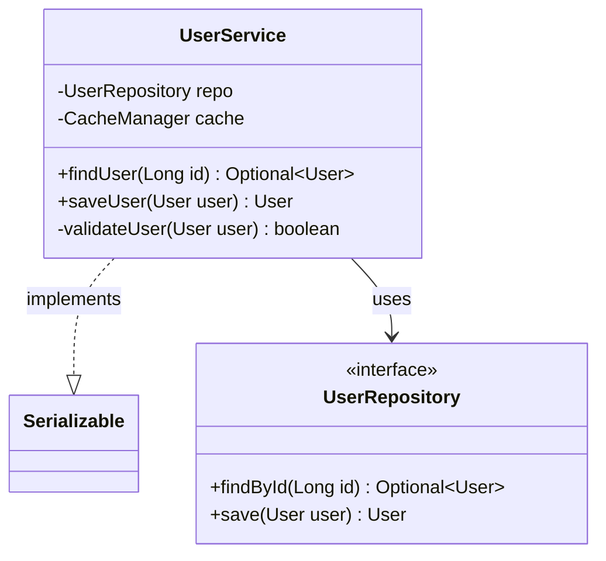
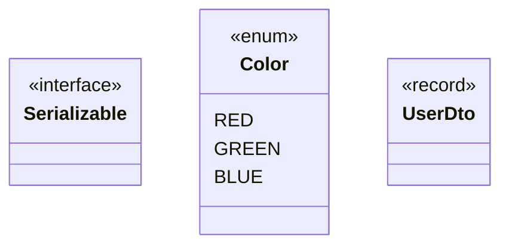

# Output Formats

Skelecode produces two output formats from the same unified IR. Both formats contain the same structural information, optimized for different consumers.

## Mermaid Format

### Purpose

Human-friendly visual diagrams, renderable in GitHub Markdown, VSCode preview, Mermaid Live Editor, and documentation tools.

### Class Diagram

Each module produces a `classDiagram` block:



### Visibility Markers

| Marker | Meaning |
|---|---|
| `+` | public |
| `-` | private |
| `#` | protected |
| `~` | package-private / internal / pub(crate) |

### Relationship Arrows

| Arrow | Meaning | Example |
|---|---|---|
| `<\|--` | extends (inheritance) | `Animal <\|-- Dog` |
| `..\|>` | implements | `UserService ..\|> Serializable` |
| `-->` | calls / uses | `Parser --> Lexer` |

### Type Kind Stereotypes

Types annotated with their kind for clarity:



### Scaling Strategy

For large projects, diagrams are split by module to avoid unreadable mega-graphs:

```
## Module: com.example.service

​```mermaid
classDiagram
    ...
​```

## Module: com.example.repository

​```mermaid
classDiagram
    ...
​```
```

Cross-module relationships are listed in a separate summary section.

---

## Machine Context Format

### Purpose

Ultra-compact, token-optimized format designed for LLM consumption. Preserves all structural and relational information in minimal tokens.

### Syntax Reference

```
@tag value
```

All tags use the `@` prefix. Indentation indicates nesting (2 spaces per level).

### Tags

| Tag | Scope | Description | Example |
|---|---|---|---|
| `@lang` | top | Language identifier | `@lang java` |
| `@mod` | top | Module/package path | `@mod com.example.service` |
| `@pkg` | top | Alias for `@mod` (Java/Kotlin convention) | `@pkg com.example.service` |
| `@file` | top | File path (JS/TS where modules = files) | `@file src/utils/parser.js` |
| `@type` | top | Type definition with kind | `@type UserService [class]` |
| `@vis` | nested | Visibility modifier | `@vis public` |
| `@field` | nested | Field (alternative to inline `{}` syntax) | `@field repo:UserRepository` |
| `@fn` | nested/top | Method or function | `@fn findUser(Long)->Optional<User>` |
| `@ext` | nested | Extends (inheritance) | `@ext AbstractService` |
| `@impl` | nested | Implements interface/trait | `@impl Serializable` |
| `@calls` | suffix | Direct call references | `@calls[repo.findById, cache.get]` |
| `@ann` | suffix | Annotations/decorators | `@ann @RestController` |
| `@gen` | suffix | Generic type parameters | `@gen <T, U>` |
| `@export` | suffix | Exported (JS/TS) | `@export` |
| `@static` | suffix | Static method/field | `@static` |
| `@enum` | nested | Enum variants | `@enum Red, Green, Blue` |

### Full Example — Java

```
@lang java
@pkg com.example.service
@type UserService [class] {repo:UserRepository, cache:CacheManager}
  @vis public
  @ext AbstractService
  @impl Serializable
  @ann @Service, @Transactional
  @fn findUser(Long)->Optional<User> @calls[repo.findById, cache.get]
  @fn saveUser(User)->User @calls[repo.save, cache.invalidate, validateUser]
  @fn validateUser(User)->boolean @vis private

@pkg com.example.repository
@type UserRepository [interface]
  @vis public
  @ann @Repository
  @fn findById(Long)->Optional<User>
  @fn save(User)->User
  @fn deleteById(Long)->void
```

### Full Example — JavaScript/TypeScript

```
@lang js
@file src/utils/parser.js
@fn parseConfig(string)->Config @export @calls[validate, normalize]
@fn validate(object)->boolean @calls[checkSchema]
@fn normalize(Config)->Config

@file src/models/token-stream.js
@type TokenStream [class] {tokens:Token[], pos:number}
  @export
  @fn next()->Token
  @fn peek()->Token @calls[this.next]
  @fn collect()->Token[] @calls[this.next]
```

### Full Example — Kotlin

```
@lang kotlin
@pkg com.example.api
@type UserController [class] {service:UserService}
  @vis public
  @ann @RestController, @RequestMapping("/api/users")
  @fn getUser(Long)->ResponseEntity<User> @ann @GetMapping("/{id}") @calls[service.findUser]
  @fn createUser(UserDto)->ResponseEntity<User> @ann @PostMapping @calls[service.saveUser]

@pkg com.example.model
@type User [data class] {id:Long, name:String, email:String}
  @vis public
  @impl Serializable
```

### Full Example — Rust

```
@lang rust
@mod parser
@type Parser [struct] {source:String, pos:usize}
  @vis pub
  @fn new(String)->Self @static
  @fn parse(&self)->Result<AST> @calls[Lexer::tokenize, AST::new]
  @fn expect_token(&self, TokenKind)->Result<Token>
  @impl Display
  @impl Debug

@mod ast
@type AST [enum]
  @vis pub
  @enum Expr(Expr), Stmt(Stmt)

@type Expr [struct] {kind:ExprKind, span:Span}
  @vis pub
  @fn new(ExprKind, Span)->Self @static

@mod lexer
@fn tokenize(&str)->Vec<Token> @vis pub @calls[Token::new, classify_char]
@type Token [struct] {kind:TokenKind, span:Span, text:String}
  @vis pub
```

### Design Principles

1. **Minimal tokens** — no filler words, no redundant syntax. Every character carries meaning
2. **Scannable** — both AI and humans can read it. `@` tags create natural visual anchors
3. **Extensible** — new `@` tags can be added without breaking existing parsers
4. **Language-unified** — same tag vocabulary across Java, JS, Kotlin, Rust. Language-specific concepts are mapped to common tags
5. **One line per concept** — each method, field, or relationship is at most one line. AI can quickly jump to what it needs
6. **Direct calls only** — transitive call paths are derived from the graph, not duplicated

### Token Comparison

For a typical Java class (~200 lines of source code):

| Representation | Estimated tokens |
|---|---|
| Raw source code | ~800-1200 |
| Machine Context | ~50-100 |
| **Reduction** | **~90-95%** |
